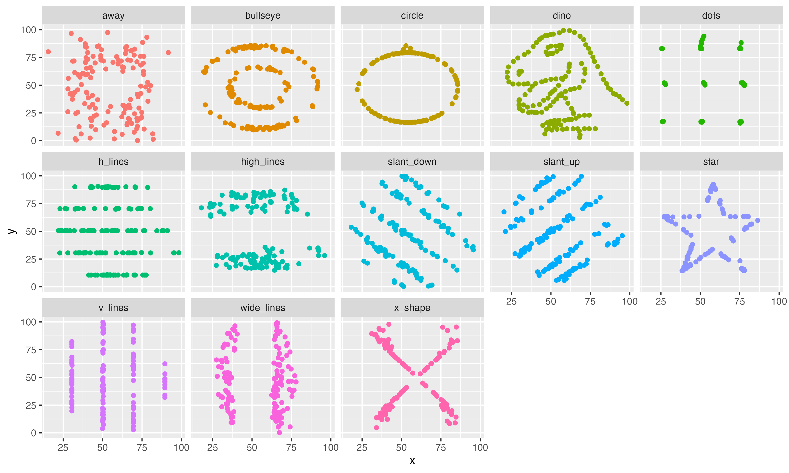
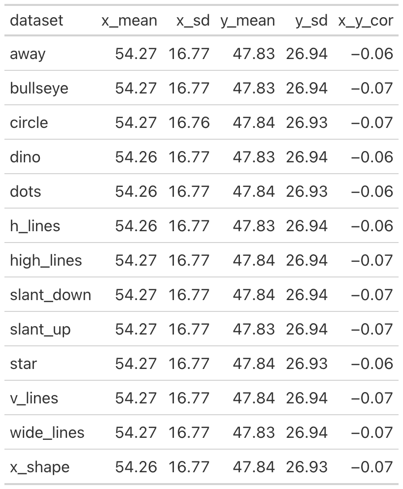
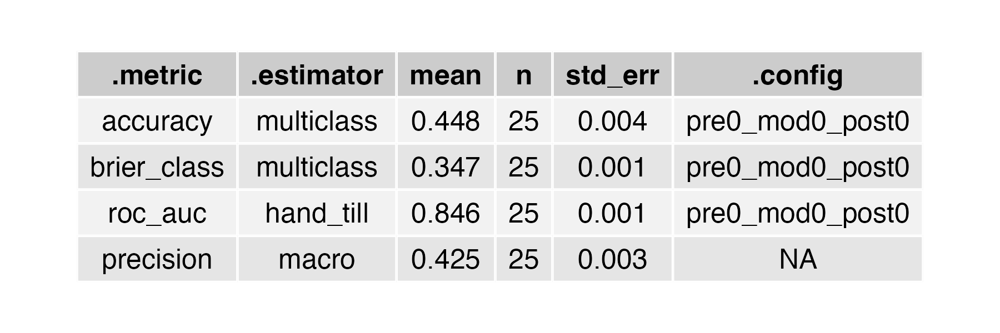
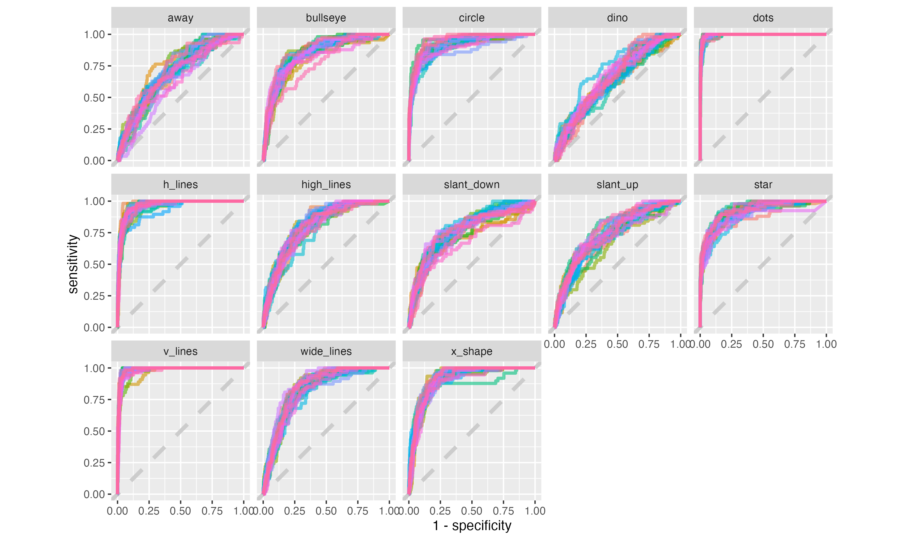
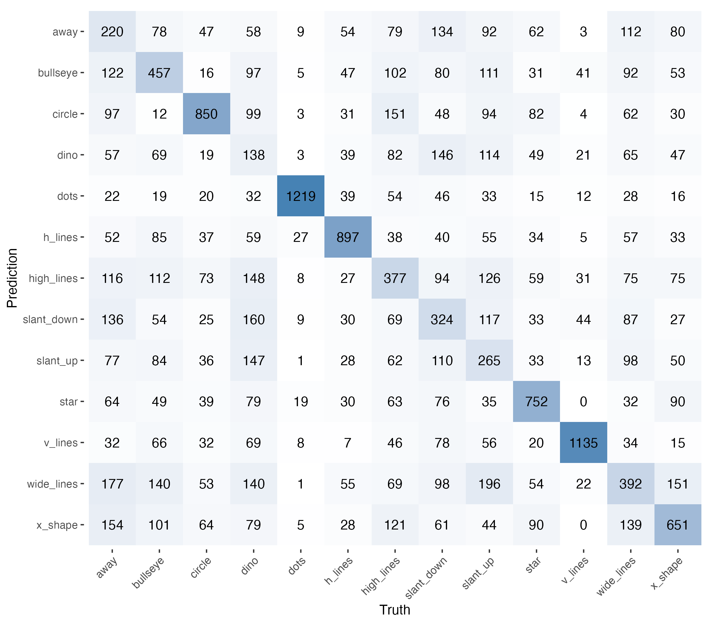
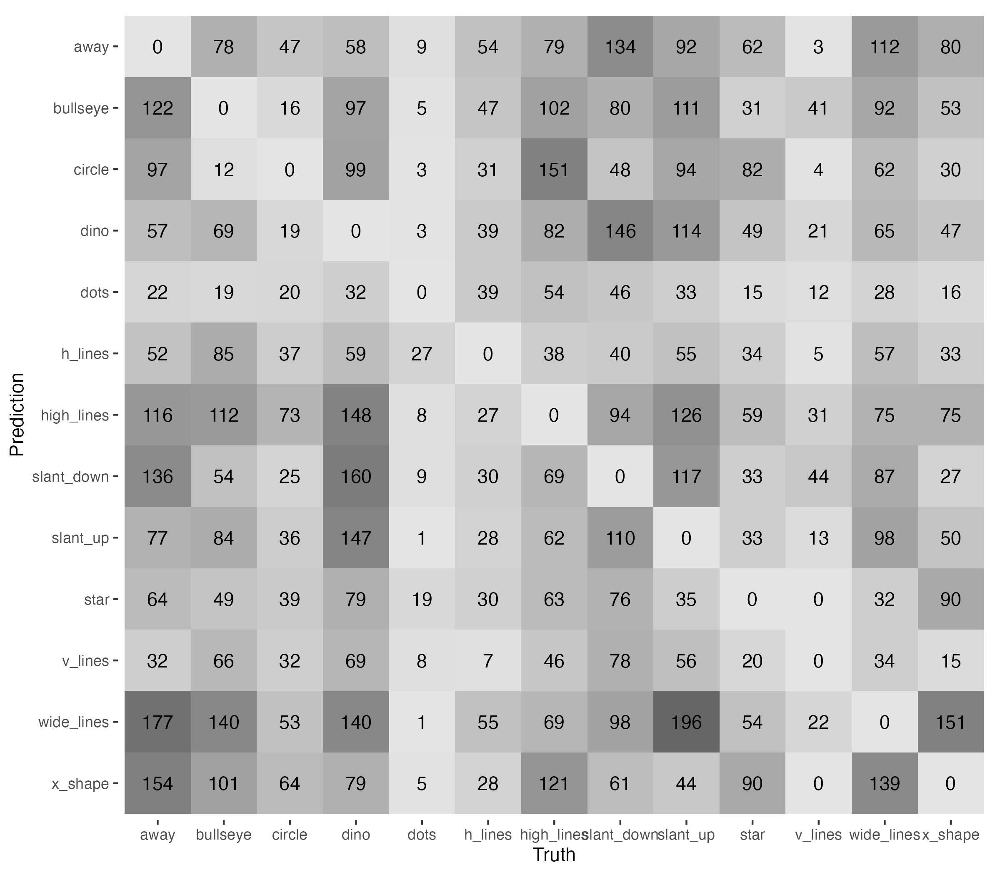

## EDA

From the dot plot, we see different patterns in the data distribution across the 13 datasets, even though each dataset contains the same count of points (142) and their summary statistics are nearly identical.

## Random Forest Model

### Data Preparation using Bootstrap

We resample the data using bootstrap to create multiple training sets, which allows us to estimate the variability of our model's performance and obtain more robust predictions. Originally, there are 13 datasets with 142 rows in each, 13 x 142 = 1846 total rows. Each bootstrap resample is still ~1846 rows (sampled with replacement from the original 1846), just with some rows duplicated and others omitted. That's why one of the outputs showed splits like [1846/672], meaning 1846 rows in the training portion and 672 in the held-out (not being selected) portion for that resample. There are 25 bootstraps created. The number 25 is just the default value of the bootstrap function.

### Model Fitting

We use random forest model with 1000 trees. Each of the 25 bootstrap resamples gets its own independent random forest, trained from scratch with 1000 trees on that resample's training portion. So across the whole fit_resamples() call, 25 × 1000 = 25,000 trees get trained in total.

However, these 25 forests are not combined into one final model. The purpose here is evaluation, not building a deployable model. Each of the 25 forests is fit and then evaluated on its own held-out portion (the ~672-ish rows not used in training), giving us 25 separate performance estimates (accuracy, ROC AUC, etc.) that we then average (collect_metrics()) to get a sense of how well this modeling approach generalizes, along with a measure of variability across resamples.

## Evaluation

### ROC-AUC

From the ROC Curves plot, we see that dino is the hardest plot for the model to predict, while dots, h_lines, v_lines are easier. When we visually compare the first dot plot on top with the roc curve plot, it aligns with our expectations as there is no clear pattern shown in the dino dataset.

### Confusion Matrix

The confusion matrix shows the number of correct and incorrect predictions for each class. By checking the diagonal axis, we can see the number of correct predictions for each class, the higher values with darker color blocks mean better prediction.

### Confusion Matrix (Misclassified)

Removing the diagonal values by setting them all 0, we can compare the misclassifications across different classes. Using dino as the example, we can see the model struggles the most with predicting this class and confused with other classes. Another example we can see easily is the wide_lines class. The model would be confused with other classes as well such as away (177), bullseye (140), dino (140), slant_up (196), and x_shape (151).